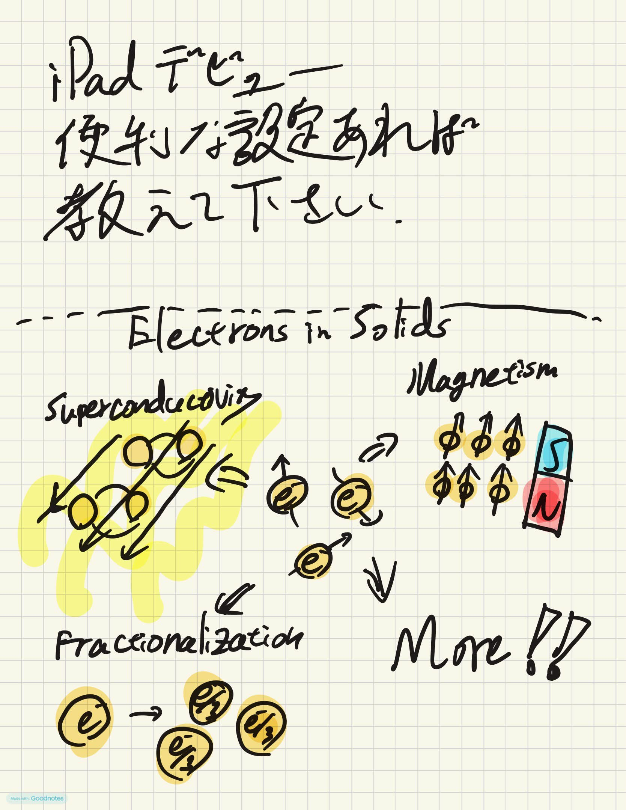

# log
記録

**2026/07/22** 生活の構築。昼寝。ルームメイトとピザ屋さん。

**2026/07/21** アメリカ到着。気づいたらついてた。太陽が出てたときは暑かったけど、夜は寒く感じる。

**2026/07/20** 送別会。ありがとう！みんなに出会えたことに感謝。

**2026/07/19** また家を出た。ワールドカップの決勝、スペインが強すぎた。

**2026/07/18** 細かいものの買い物。何が必要で何が必要でないかはよくわからない。Xiaodong Xu大先生の[2D Ferromagnet](https://youtu.be/CmhiZQFO2vU?si=jXqkkoe8Aa1lp2gz)の動画を見てみた。2次元強磁性でかなりおもしろそうなことができそう(周知の事実)。

**2026/07/17** バレー見た。口頭試験は1年目の終わりにあるらしい。つらい。

**2026/07/16** IGRA用に採血してもらった。渡航外来とういうものの、そんなに慣れてなさそうだった。Telloを契約し、アメリカでの電話番号を入手した。めっちゃ楽だった。My new gearということでLogiのMX Master4を買った。壊れるまで使います。せっかくPixelを使っているのでPixel Watchを導入したいがスマートウォッチって便利なのでしょうか。Apple Watchとか使ってる人に聞きたい。[バルク物質の動画](https://youtu.be/QL5C4DYWaw8?si=jIOk8Rkz67aP9H57)。物性の原点・本流という感じでかっこいい。内容はあまり理解できなかったがおもしろかった。仲良くなりたい。一緒に研究したい。あと、男子バレー日本対カナダを見た。ぎりぎりの試合が多い。

**2026/07/15** 祖父に免許返納を勧める。アメリカのネット通信は日本でも契約できそうなので近日中にやる。銀行は店行かないとねえ。難しい。あと、男子バレー日本対イタリアを見た。

**2026/07/14** アメリカは250年後=建国500周年 (quincentennial) に向けてタイムカプセルを埋めるらしい ([参照](https://www.gov.ca.gov/2026/06/15/governor-newsom-and-first-partner-siebel-newsom-highlight-californias-contributions-to-the-america250-time-capsule/))。他の州は知らないが、カリフォルニア州は量子コンピュータのチップ (Berkeley産!!) と核融合の何か (と他5つ) を埋めるらしい。再注目のテクノロジーである。この2つを学べる学科って結構すごいはず。250年後には当たり前の技術になっているのだろうか。もしかしたら時代遅れかも。[わかりやすい2次元超伝導の記事](https://qiita.com/yamadasuzaku/items/b757761f9da3e0ed2b7c#21-%E3%81%BE%E3%81%A8%E3%82%81)を見つけた。2次元と3次元でのCoulomb力の距離依存性の違い、VortexとAnti-Vortex、など。若いうちに一度海外に出ることは大事そうだなと思う。

**2026/07/13** Requirementの確認をしてみた。卒業に必要なのは32 units。ぱっと見、一つの授業が4 unitsなので、各学期に2つずつ受ければ、2年目で履修は終わる？24/32はgraduate-levelの授業。また、18 unitsはmajor、8 unitsはminorにする必要がある。MajorはPhysics系にするとして、Minorは何にしようか。留学前にはワクチン関係の要件を本当によく確認しておこう。地域や大学ごとに異なります。渡航外来やトラベルクリニックに行きましょう。書類は締め切りの2ヶ月前を仮の締め切りとするとよいです。私は失敗しかけました。助けてくれた方々ありがとうございました。[WTe2のQSHIやSCの初期の動画](https://www.youtube.com/live/FrkKrgTwy28?si=npuYprkHyhL0t88o)を見た。わかりやすかった。磁気抵抗によるバンド構造の同定。磁場印加によるQSHIの同定。超伝導。話しているのは現CornellのValla Fatemiである。彼はPh.D. (PJH研) では2次元をやっていたが、今は量子回路の研究室を運営している。より良い超伝導量子ビットの作り方みたいな。素人目線ではすごい方針転換に思える。すごい。

**2026/07/12** 市役所にて転出届の提出。1年以上海外にいる人は転出届の申請が推奨されている。ちょっとだけ個人情報を書いて、マイナンバーを見せてらすぐ終わった。転出届を出すと、国民健康保険や年金の支払いがストップする。つまり、一時帰国中に病院のお世話になると面倒。年金は後でまとめて支払える。年金を払うことに意味があるかどうかはまた別のお話。なお、マイナンバーは維持できる。Pixel 10aに機種変更。日々Google様のサービスにお世話になっているため、Google様のスマホを買うことは年貢であるし、シナジーも期待できる。日本の電話番号はpovoにより保持する予定。電話番号を雑に捨ててしまうと、いろいろなアカウントが乗っ取られてしまう可能性がある。povoは安い。iPad+Apple Pencilを購入した。Googleのスマホを買い、ついにApple製品を使うことになってしまった日。背に腹は代えられない。

**2026/07/11** 免許証は更新期間外でも出国前や一時帰国中に更新できる模様。アメリカでの銀行口座の開設にはパスポートやビザ、いくらかの現金、住所があればいけるようである。iPadが欲しい。ペンは安いやつでいいのだろうか。フィルムは貼っても使用感は変わりませんか。教えてください。

**2026/07/10** お泊り。慶應義塾編fin。刺激的な4年間と少しだった。戻ってくるのだろうか。次の5年間はもっとかましたい。

**2026/07/09** 一応ラスト矢上。先生方に挨拶回り。みなさま優しいです。ありがとうございました。

**2026/07/08** 退去のためにどたばた。からの焼き肉。パリティ対称性と時間反転対称性とその規約表現4つ。退去のコツ。ごみを早めに捨てる。特に粗大ごみは早めに検討をつける。ガス、水道、ネットの解約は進めているか！？否、進めていない。留学準備のコツ。ワクチンは打ったか！？否。銀行口座やネットの契約は考えているか！？否。すぐに連絡がつく友達、近くに住んでいる友達をもとう！！

**2026/07/07** メールメールメールメール…。事後報告ばっかりしていた。夜は焼き肉！ごちそうさまでした！

**2026/07/06** 海外大学院留学説明会@慶應。参加者は40人くらい。講演者の方々がいい人たちでとてもよかった。自分にとっても学びがあった。来年もやりたい。

**2026/07/05** 夏祭り。楽しかった～。物価は大変なことになっていたがworth.

**2026/07/04** twisted MoTe2について。MXとXMとMMがあることによって、擬スピンのスキルミオンみたいになることによってベリー曲率を獲得して曲がる。おおそらく最後のラテグラ。

**2026/07/03** どったばったどったばったで月曜日の準備。

**2026/07/02** 英語の授業に潜入し、プレゼンを見た。

**2026/07/01** Rhombohedral grapheneの博論を発掘。

**2026/06/30** 手続きを確認。予防接種が足りないことに気づいた。やばい。

**2026/06/29** 送別会、二次会、ワールドカップ。

**2026/06/28** Landauの超流動安定条件。いい感じの[pdf](https://mercury.yukawa.kyoto-u.ac.jp/~bussei.kenkyu/wp/wp-content/uploads/2021-091201.pdf)。スライドの作製。[あまり手ごたえの良くない文章](https://xplane.jp/enroll2026-1-masuda/)が公開されてしまった。

**2026/06/27** マイクロ波による超流動stiffnessの測定

**2026/06/26** Photonicsのノリが何となくわかった。また、グラフェンの超伝導は不思議。サッカー見た。

**2026/06/25** twisted trilayer graphene

**2026/06/24** 飲み会。

**2026/06/23** 何もしてない気がする

**2026/06/22** 船井のパーティー

**2026/06/21** 前日の飲み会で飲酒、昼まで寝る、サッカーを見る、昼寝する、起きてちょっと作業する、飲み会に行く。

**2026/06/20** 研究室でパーティー。続々と留学の同期の[文章](https://funaifoundation.jp/scholarship/grantees_up_to_now.html)が出ています。すてきですね。

**2026/06/19** 正午まで爆睡。何もやっていない。

**2026/06/18** お世話になった先生とご飯！楽しかった！

**2026/06/17** [Quanntum geometry in condensed matter](https://academic.oup.com/nsr/article/12/3/nwae334/7762198)より、quantum geometric tensorの実部がquantum metricで、虚部がberry connection。いろいろと計算すると、非線形Hall効果にそれぞれが寄与して、対称性から分離ができる。実部の方は超伝導でも大事らしい、よくわからんけど。boson演算子をholstein primakoffするとスピン演算子がつくれる。bosonの模型とスピンの模型は等価、らしい。

**2026/06/16** Quantum metric

**2026/06/15** 体調不良。[大学院留学説明会@慶應のサイト](https://gakuiryugaku.net/seminar/6240)を作成。Fermi液体とかGreen関数をちゃんと勉強したい。

**2026/06/14** SSH模型は教育的かつ本質的で素晴らしい。

**2026/06/13** もんじゃ。びっくりした。

**2026/06/12** Peierls位相はタイトバインディング版のAB位相と思った。[トポロジカル物質の分類のわかりやすい解説記事](https://www.jstage.jst.go.jp/article/jsssj/32/4/32_4_209/_article/-char/ja/)。

**2026/06/11** 何もわからん。

**2026/06/10** 阪大の彼と岐阜の彼はさみしいらしいので近くに寄ったときは会いに行ってあげてください。[超伝導量子回路](https://www.jstage.jst.go.jp/article/butsuri/75/10/75_610/_article/-char/ja/)のよさげなpdf。分数電荷によるエキシトン[1](https://www.nature.com/articles/s41586-024-08274-3?fromPaywallRec=false)と[2](https://www.nature.com/articles/s41567-026-03325-0)。Big wave

**2026/06/09** 岐阜名古屋奈良大阪旅行終了。いろんな人と物事を見られてよかったです。どの分野もお金を儲けようとだけする人がいるっぽい。

**2026/06/08** 移動。頑張りたい。Lifetime Respect

**2026/06/07** さすがに田舎。

**2026/06/06** 岐阜。下呂温泉。チルい場所。

**2026/06/05** 3回登録しても不具合により振り出しに戻らされた。明日の朝トライする。結局、ゲージ不変な形式のときは南部-Goldstoneモードは消えるっぽい。そもそも対称性を破っていないのだから。電磁場($A$)とHiggsモード($H$)は$A^2H$のように結合し、光子を2つ吸ってHiggsモードが励起される。定常電場がある場合は$AH$。誰も触っていない誰も使い方がわからない装置を触ってみている。使い方はわかったが、正常な信号が得られない。装置が悪いのか試料が悪いのかそもそもできないのか。可視化する系の実験はわかりやすいが心の目が必要である。Berry位相周辺を再度復習した。バルクがわかればエッジがわかる。

**2026/06/04** ナノフォトニクスと水素化合物系超伝導。応用っぽい発表と基礎っぽい発表。どちらも低レイヤーから高レイヤーまで。Microsoft "[Majorana 2](https://www.youtube.com/watch?v=1bN4O5_meB4)"。いわゆるトポロジカル量子コンピュータ。Majorana粒子($c=c^\dagger$)を用いている。Majorana粒子は粒子の交換の順序に状態が依存する。Majorana粒子はトポロジカル絶縁体とs波超伝導体の界面にできるといわれていて、今回は超伝導体をAl(Tcだいたい1.2 K)からPb(Tcだいたい7.2 K)に変更したらしい。でも、Majorana粒子って見つかってるんですか？

**2026/06/03** 量子スピン液体もオンサイトの項っぽいものと遍歴の項っぽいものでできてる？Anderson-Higgs機構を勘違いしていたことに気づく。ゲージ不変な表式のときはこの辺りはどうなるのだろうか。エネルギー固有状態はすべて (strong) またはほとんど (weak) 平衡状態 (固有状態熱化仮説:ETH) らしいが、反例もあるらしい。非平衡超伝導は反例ってことかな。

**2026/06/02** 驚くほど短い一日だった。ビザは無事に発行されたみたい。船井の報告書もいったん完成した。[マグノンのスクイージングの論文](https://www.nature.com/articles/s41567-026-03294-4)を読んだが、いまいちよくわからなかったのでスクイージングを勉強。量子情報の盛り上がりを感じる。

**2026/06/01** しばらく続けられたらと思う。2次元以下での粒子の交換とエニオン、Braid group。交換の順序が大事でまさしく組みひも。1次元だと？？船井の報告書を書き進める。
