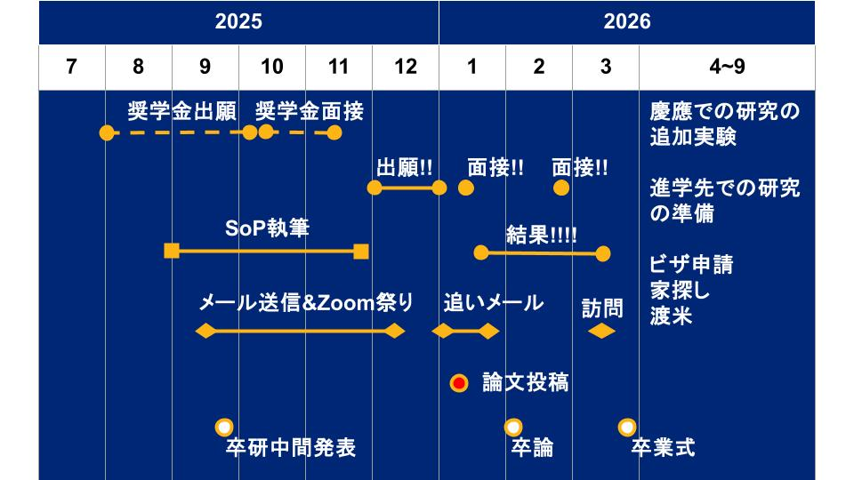

# Study abroad

アメリカの博士課程は年収が大体1000万円くらいです。

**[funai_report](https://github.com/YutoMSD/log/blob/main/study_abroad/funai_report/README.md)** 船井財団報告書元ファイル

**[research_group](https://github.com/YutoMSD/log/blob/main/study_abroad/research_group/README.md)** 研究室や大学の選び方について。特に物性物理。

**[scholarship](https://github.com/YutoMSD/log/blob/main/study_abroad/scholarship)** 大学院留学に使える奨学金のリストとコメント

**[SoP](https://github.com/YutoMSD/log/blob/main/study_abroad/SoP)** SoPについて

出願のスケジュールは以下の図
